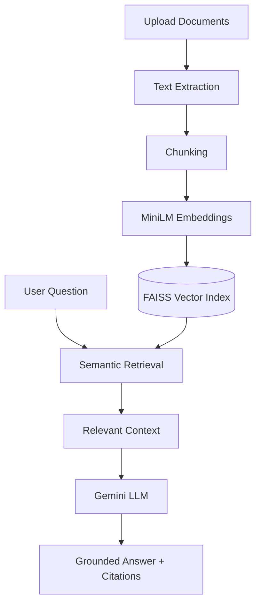

# Dynamic RAG Generator

A document-based **Retrieval-Augmented Generation (RAG)** application built using Python, FastAPI, Streamlit, FAISS, Sentence Transformers, SQLite, and Google Gemini.

Users can upload documents at runtime, create independent knowledge bases, and ask questions to receive grounded answers with source citations.

## 1. Features

- **Dynamic document ingestion:** Upload PDF, DOCX, and TXT files at runtime.
- **Multiple collections:** Create and manage independent document knowledge bases without code changes.
- **Semantic search:** Sentence Transformers (`all-MiniLM-L6-v2`) and FAISS retrieve relevant document chunks.
- **Grounded answers:** Gemini generates responses using retrieved evidence.
- **Source citations:** Answers include references to supporting document excerpts.
- **Hallucination control:** Returns insufficient-evidence responses when relevant information is unavailable.
- **Persistent storage:** SQLite metadata and locally persisted FAISS indexes.
- **Interactive interface:** Streamlit frontend with FastAPI REST backend.
- **Flexible LLM integration:** Gemini, Hugging Face, and Ollama configurations.

## 2. Technology Stack

| Component | Technology |
|---|---|
| Backend | Python, FastAPI |
| Frontend | Streamlit |
| Embeddings | Sentence Transformers |
| Vector Search | FAISS |
| Database | SQLite |
| LLM | Google Gemini |
| Alternative LLMs | Hugging Face, Ollama |
| Testing | Pytest |

## 3. Architecture



**Workflow:** Documents are uploaded, chunked, embedded, and indexed. When a user asks a question, the system retrieves relevant chunks from the selected collection and generates a citation-backed answer.

## 4. Installation and Setup

### Prerequisites

- Python 3.10–3.12
- Gemini API key
- Internet connection for initial dependencies and model downloads

### Clone the repository

```bash
git clone https://github.com/yvardhan8563/dynamic-rag-generator.git
cd dynamic-rag-generator
```

### Create a virtual environment

Windows:

```powershell
python -m venv .venv
.\.venv\Scripts\Activate.ps1
```

### Install dependencies

```bash
python -m pip install -e ".[dev]"
```

### Configure environment variables

Copy `.env.example` to `.env`:

```powershell
Copy-Item .env.example .env
```

Configure your Gemini credentials in `.env`:

```dotenv
GEMINI_API_KEY=your_gemini_api_key
GEMINI_MODEL=your_supported_gemini_model
```

Do not commit your `.env` file or API credentials.

## 5. Run the Application

**Start FastAPI backend:**

```bash
python -m uvicorn app.main:app --host 127.0.0.1 --port 8000 --workers 1
```

API documentation: http://127.0.0.1:8000/docs

**Start Streamlit frontend in another terminal:**

```bash
python -m streamlit run frontend/streamlit_app.py
```

Frontend: http://localhost:8501

## 6. How to Use

1. Open the Streamlit interface.
2. Create a new document collection.
3. Upload PDF, DOCX, or TXT documents.
4. Index the uploaded documents.
5. Select the collection and ask questions.
6. Review the generated answer and supporting citations.
7. Switch collections to query a different document set without modifying code.

## 7. API Endpoints

All endpoints use the `/api/v1` prefix.

| Method | Endpoint | Purpose |
|---|---|---|
| POST | `/collections` | Create collection |
| GET | `/collections` | List collections |
| DELETE | `/collections/{id}` | Delete collection |
| POST | `/collections/{id}/documents` | Upload document |
| GET | `/collections/{id}/documents` | List documents |
| DELETE | `/collections/{id}/documents/{document_id}` | Delete document |
| POST | `/collections/{id}/query` | Ask a question |
| GET | `/health/live` | Health check |

Interactive request and response examples are available through FastAPI Swagger UI.

## 8. Testing

Run automated tests:

```bash
python -m pytest -q
```

Development validation reported **46 passing tests**.

Run the end-to-end RAG smoke test with the backend running and an LLM provider configured:

```bash
python scripts/smoke_rag.py
```

Testing covers document ingestion, retrieval, collection isolation, persistence, API handling, citations, and insufficient-evidence behavior.

## 9. Design Decisions

- **FastAPI:** Lightweight REST backend with automatic API documentation.
- **Streamlit:** Simple interface for document upload and question answering.
- **MiniLM:** CPU-friendly embeddings for semantic retrieval.
- **FAISS:** Efficient local vector similarity search.
- **SQLite:** Persistent storage without an external database server.
- **Gemini:** Hosted LLM generation using retrieved document context.
- **Independent collections:** Support different document sets without code modifications.

## 10. Limitations

- Scanned PDFs require OCR, which is not currently included.
- Semantic retrieval quality depends on document content and question wording.
- The application is designed for local, single-worker execution.
- Production deployment would require authentication, access controls, and additional monitoring.

## 11. AI-Assisted Development

**AI coding tool:** OpenAI Codex (VS Code).

Codex was used for architecture development, implementation, debugging, and testing.

The complete original AI agent transcripts are provided separately through the Google Drive link in the assessment submission form.

## 12. Conclusion

The Dynamic RAG Generator demonstrates an end-to-end RAG workflow supporting runtime document ingestion, semantic retrieval, grounded question answering, source citations, persistent storage, and multiple independent document collections without code changes.