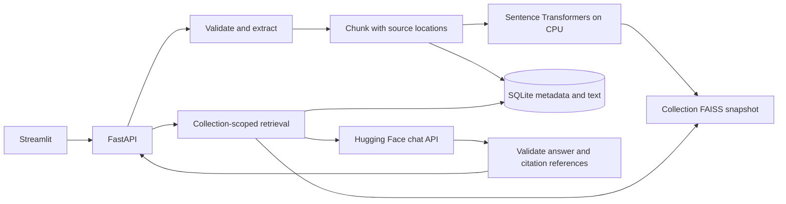

# Dynamic RAG Generator

A local document question-answering application built with FastAPI, Streamlit,
Sentence Transformers, FAISS, and SQLite. Upload PDF, DOCX, or TXT documents into
independent collections and ask questions with traceable source citations.
Hugging Face Inference Providers supplies the answer-generation model.

## Quick start

Requires Python 3.10–3.12 (64-bit). Run commands from the repository root.
The first installation downloads Python dependencies, including CPU ML libraries.
The first document upload downloads the embedding model unless already cached.
No database server, Docker, or GPU is required.

Windows PowerShell:

```powershell
python -m venv .venv
.\.venv\Scripts\python.exe -m pip install --upgrade pip
.\.venv\Scripts\python.exe -m pip install -e ".[dev]"
Copy-Item .env.example .env
```

macOS/Linux:

```bash
python3 -m venv .venv
.venv/bin/python -m pip install --upgrade pip
.venv/bin/python -m pip install -e '.[dev]'
cp .env.example .env
```

Do not overwrite an existing `.env`. Edit it locally and set:

```dotenv
HF_TOKEN=your-token-here
RAG_LLM_BASE_URL=https://router.huggingface.co/v1
RAG_LLM_MODEL=Qwen/Qwen3-235B-A22B-Instruct-2507
```

Your token needs **Make calls to Inference Providers** permission. Choose a chat
model available through your provider/account; a model existing on the Hub does
not guarantee hosted inference availability. The example uses a non-thinking
instruct model; model and provider availability may change. Check the
[Hugging Face playground](https://huggingface.co/playground) or
[Inference Providers documentation](https://huggingface.co/docs/inference-providers/index).
Inference may require available credits. No OpenAI key or SDK is needed.

Start the backend in one terminal:

```powershell
.\.venv\Scripts\python.exe -m uvicorn app.main:app --host 127.0.0.1 --port 8000 --workers 1
```

Start the frontend in another terminal:

```powershell
.\.venv\Scripts\python.exe -m streamlit run frontend/streamlit_app.py
```

On macOS/Linux, replace `.\.venv\Scripts\python.exe` with `.venv/bin/python`.
Open **http://127.0.0.1:8501**. Interactive API documentation is at
**http://127.0.0.1:8000/docs**. Restart the backend after changing `.env`.

## Walkthrough

### Gemini generation

The backend also supports Google's Gemini chat-completions compatibility API.
Set these variables in `.env` (plain underscores, no backslashes):

```dotenv
GEMINI_API_KEY=your_actual_gemini_api_key
GEMINI_MODEL=gemini-3.1-flash-lite
```

Replace the placeholder with your actual key locally. When either Gemini setting
is present, Gemini takes precedence over the older Hugging Face/Ollama settings;
a missing key fails explicitly instead of falling back to another provider.
Remove both Gemini settings to return to the compatible-provider configuration.
Restart the backend after changes. Existing embeddings/indexes remain valid.
Model availability and quotas depend on your Google project; the example model
is configurable. Keys are sent only to Google's fixed HTTPS endpoint and are
never included in URLs or UI responses. See Google's
[compatibility API documentation](https://ai.google.dev/gemini-api/docs/openai).

### Local generation with Ollama

As an alternative to hosted inference, install [Ollama](https://ollama.com/download/windows)
and run these commands in a new PowerShell terminal:

```powershell
ollama pull qwen2.5:3b
ollama run qwen2.5:3b
```

The second command opens a standalone chat for a quick model check. Type `/bye`
to leave it; the application uses Ollama's background API, not this chat session.
If the API is not running, start `ollama serve` in a separate terminal.

Set the following values in `.env`, replacing the corresponding hosted settings:

```dotenv
RAG_LLM_BASE_URL=http://127.0.0.1:11434/v1
RAG_LLM_MODEL=qwen2.5:3b
RAG_LLM_API_KEY=
RAG_LLM_TIMEOUT=120
```

Restart FastAPI, then run `python scripts/smoke_rag.py` using the project virtual
environment. Existing documents do not need re-indexing: only generation changes.
Local generation needs no hosted inference credits, but uses your machine's RAM
and CPU/GPU; latency and answer quality depend on the model and hardware.
The adapter uses Ollama's [chat API compatibility endpoint](https://github.com/ollama/ollama/blob/main/docs/api/openai-compatibility.mdx).

### Use the application

1. Create a collection with any name.
2. Upload your documents and select **Index uploaded documents**. Results are
   shown separately for each file; refresh collection details to update counts.
3. Ask a question supported by the documents. Expand each citation to inspect
   the exact excerpt and its page, paragraph/table row, or line range.
4. Ask an unrelated question to exercise insufficient-evidence handling.
5. Create another collection and verify that its answers cannot draw on the first.
6. Remove a document, then restart the backend to verify persistence.

Collections and documents are entirely runtime data. Sample policies in tests
are generated fixtures and are never loaded by the application.

## Architecture and trade-offs



- **Small modules, no RAG framework:** processing, storage, retrieval, generation,
  and UI remain independently testable. Routes are kept in `app/main.py` while
  business logic lives in services.
- **Exact FAISS search:** normalized vectors with `IndexFlatIP` give cosine
  similarity without index training. Memory and query cost grow with collection
  size; this baseline favors modest local collections over approximate search.
- **Chunking:** preserve extracted passage boundaries, split by embedding-token
  offsets, and overlap within passages. Default 200 tokens with 30-token overlap,
  capped by the embedding model's sequence limit. Short passages are not merged.
  Locations describe the containing source passage, not precise bounding boxes.
- **Persistence:** SQLite stores metadata and text; immutable FAISS snapshots
  store vectors. Updates reuse existing vectors and rebuild the flat index.
  A complete file is written before its reference is committed in SQLite.
  Failed transactions discard the new snapshot. Old/orphan snapshots are removed
  after commits or on startup. Filesystem damage is surfaced explicitly, not
  silently ignored. Back up the entire data directory while the backend is stopped.
- **Concurrency:** one backend worker per data directory, enforced with a file
  lock. One ingestion at a time bounds embedding work; busy uploads receive 429.
  A fixed pool of collection locks coordinates retrieval, publication, and
  deletion. Queries use committed data; embedding inference is serialized.
- **Grounding:** top-k retrieval, configurable similarity filtering, and bounded
  evidence context precede generation. Empty/weak retrieval skips the LLM.
  Otherwise the LLM can abstain. Structured output and citation IDs are validated;
  unknown or missing references are rejected rather than displayed.
- **Context:** evidence is capped at 12,000 characters, keeping whole chunks.
  This simple provider-independent limit is not an exact LLM tokenizer budget.
  Output is capped at 800 tokens; choose a model with sufficient context capacity.
- **LLM adapter:** plain HTTP to a chat-completions endpoint. A local compatible
  server also works by overriding endpoint/model; set `RAG_LLM_API_KEY` if it
  requires authentication. `HF_TOKEN` is sent only to the HTTPS Hugging Face router.

Embeddings follow Sentence Transformers'
[query/document encoding guidance](https://www.sbert.net/docs/sentence_transformer/usage/usage.html).
Only locally generated FAISS indexes are accepted; see
[FAISS's untrusted-index warning](https://github.com/facebookresearch/faiss/wiki/Index-IO%2C-cloning-and-hyper-parameter-tuning).

## Project structure

```text
app/
  main.py                 FastAPI factory, lifespan, routes, error handling
  config.py               Validated environment configuration
  schemas.py              Request and response contracts
  body_limit.py           Aggregate request-size limit
  errors.py               Safe application errors
  ingestion/              PDF/DOCX/TXT extraction and token-aware chunking
  retrieval/              Sentence Transformers and FAISS persistence
  generation/             LLM HTTP adapter and citation validation
  services/               Ingestion, deletion, retrieval, answering
  storage/                SQLite repository
frontend/                 Streamlit UI and API client
tests/                    Unit, integration, UI, and opt-in real-model checks
data/                     Runtime SQLite and FAISS files (Git-ignored)
```

## API

All routes use `/api/v1`. UUIDs are generated by the backend; names are supplied
by the user. Duplicate collection names are allowed and have independent IDs.

| Method | Path | Result |
|---|---|---|
| POST | `/collections` | Create with `{"name": "Your collection"}`; 201 |
| GET | `/collections` | List collections and counts |
| GET | `/collections/{id}` | Collection details |
| DELETE | `/collections/{id}` | Remove collection, metadata, and active index; 204 |
| POST | `/collections/{id}/documents` | Multipart `file`; index one file; 201 |
| GET | `/collections/{id}/documents` | List documents |
| DELETE | `/collections/{id}/documents/{document_id}` | Remove and rebuild index; 204 |
| POST | `/collections/{id}/query` | `{"question": "...", "top_k": 5}` |
| GET | `/health/live` | Process liveness |
| GET | `/health/ready` | Storage check and configuration/load status |

Example answer shape (illustrative content only):

```json
{
  "status": "answered",
  "answer": "The policy allows returns within thirty days. [S1]",
  "citations": [{
    "source_id": "S1",
    "document_id": "<document UUID>",
    "filename": "uploaded-policy.pdf",
    "chunk_id": "<chunk UUID>",
    "location": {"page": 2},
    "excerpt": "Returns are accepted within thirty days.",
    "score": 0.78
  }],
  "request_id": "<request UUID>"
}
```

Insufficient evidence returns HTTP 200 with `status: insufficient_evidence`, a
fixed explanatory answer, and an empty citations list. Provider failures return
errors, not unsupported answers. Similarity scores are not confidence scores.

Errors have `{ "error": { "code", "message", "request_id" } }` and the same ID
in the `X-Request-ID` header. Typical statuses: 404 missing resource; 409 duplicate
or incompatible index settings; 413 oversized input; 415 unsupported file;
422 invalid fields/document; 429 ingestion busy; 502 invalid/provider response;
503 unavailable configuration/model/provider; 504 provider timeout.

Readiness returns 503 when LLM configuration is incomplete, while collection
management and ingestion can still work. A configured provider is reported as
`configured_not_probed`: readiness does not spend credits or test remote access.
The embedding model loads lazily on first ingestion/query that needs it.

## Configuration

Backend settings come from `.env` or process environment (environment takes
precedence). The UI reads only `RAG_API_URL` from its process environment.

| Variable | Default / meaning |
|---|---|
| `HF_TOKEN` | Hugging Face token, required for HF generation |
| `RAG_LLM_BASE_URL` | Blank in code; HF router in `.env.example` |
| `RAG_LLM_MODEL` | Blank in code; example Qwen model in `.env.example` |
| `RAG_LLM_API_KEY` | Optional key for another compatible provider |
| `RAG_LLM_TIMEOUT` | 60 seconds |
| `RAG_DATA_DIR` | `./data` |
| `RAG_EMBEDDING_MODEL` | `sentence-transformers/all-MiniLM-L6-v2` |
| `RAG_MAX_UPLOAD_MB` | 10 MB per file, plus 64 KB multipart request allowance |
| `RAG_MAX_TEXT_CHARS` | 1,000,000 extracted characters per file |
| `RAG_MAX_CHUNKS` | 10,000 chunks per document |
| `RAG_CHUNK_TOKENS` | 200 |
| `RAG_CHUNK_OVERLAP` | 30 |
| `RAG_SIMILARITY_THRESHOLD` | 0.3; tune against your documents and questions |
| `RAG_CONTEXT_CHARS` | 12,000 evidence characters |
| `RAG_API_URL` | Frontend backend address; `http://127.0.0.1:8000` |

If raising the upload limit, also update `server.maxUploadSize` in
`.streamlit/config.toml`. Do not run multiple backend workers. Changing embedding
model/chunk settings requires restoring the original settings or creating a new
collection and re-uploading. Use a fixed local model directory for strict model
artifact reproducibility; an upstream model updated under the same name is not
detected by the configuration fingerprint.

## Tests and verification

```powershell
.\.venv\Scripts\python.exe -m pytest -q
.\.venv\Scripts\python.exe scripts/smoke_servers.py
```

The default suite uses deterministic embedding and LLM doubles, but real FAISS,
SQLite, extractors, FastAPI requests, and Streamlit's AppTest. It requires no token
and makes no external API calls. Tests cover all document formats, invalid input,
source locations, retrieval isolation, duplicate detection, persistence/deletion,
concurrent reads/deletion, failed file/database writes, orphan recovery, request
limits, grounded output, abstention, bad citations, HF authentication/error
mapping, prompt construction, and the UI question flow.

Run real Sentence Transformers retrieval separately:

```powershell
$env:RAG_RUN_MODEL_TESTS="1"
.\.venv\Scripts\python.exe -m pytest tests/test_model_smoke.py -q
Remove-Item Env:RAG_RUN_MODEL_TESTS
```

For an already cached model, optionally set `HF_HUB_OFFLINE=1` for this command.
On macOS/Linux use `RAG_RUN_MODEL_TESTS=1 .venv/bin/python -m pytest tests/test_model_smoke.py -q`.
Real embedding testing verifies semantic retrieval, not hosted generation quality.
A live HF check requires your locally configured token; follow the UI walkthrough
and manually inspect cited evidence. Automated provider tests simulate responses
and do not establish real-model resistance to prompt injection or hallucination.

With the backend running and your HF token configured, exercise the live API:

```powershell
.\.venv\Scripts\python.exe scripts/smoke_rag.py
```

This uses synthetic workshop-policy text, makes up to two real LLM requests
(provider charges may apply), validates a known answer and its citations, tests
abstention and collection isolation, then verifies document deletion. It removes
only its own temporary collections. It does not read or print your token.

## Operational scope and limitations

- Trusted local, single-user assessment application. Collections are not user
  authorization boundaries. Authentication, quotas, isolated parser workers,
  request deadlines, and deployment hardening are needed before public exposure.
- PDF text only; no OCR, images, headers/footers extraction for DOCX, or complex
  layout reconstruction. DOCX paragraphs/tables are extracted in separate groups.
  TXT supports UTF-8 (optional BOM) or BOM-marked UTF-16.
- Parser limits include 2,000 PDF pages and 50 MB expanded DOCX content. They are
  resource guards, not a complete defense against hostile parser inputs.
- Whole-file ingestion and exact indexes target modest collections. There is no
  background job queue, streaming answers, reranker, cross-collection search, or
  conversational memory. Queries already in flight may finish using evidence
  retrieved before a document was deleted.
- Citation validation proves references exist in supplied context, not that every
  claim is entailed. The LLM can still misunderstand evidence or follow malicious
  text. Similarity thresholds need corpus-specific evaluation.
- Original uploaded binaries are not retained. Extracted text and embeddings are
  stored locally; questions and selected excerpts go to the configured LLM
  provider. The UI renders answers/excerpts as text, not active Markdown/HTML.
- `.env`, `.env.*` (except the example), runtime data, and virtual environments are
  Git-ignored. Credentials stay on the backend and are not returned by APIs.
  Errors exclude raw provider bodies and parser exception text. Deletion is logical
  application deletion; SQLite/filesystem backups may retain historical bytes.

## Troubleshooting

- **`llm_auth_failed`:** check token validity and Inference Providers permission.
- **`llm_credits_required`:** check provider billing/available credits.
- **`llm_request_rejected`:** choose an available chat model in the HF playground;
  verify the router base URL ends in `/v1`, not `/chat/completions`.
- **`invalid_llm_response` / `invalid_citations`:** the provider did not satisfy the
  structured answer contract. Try an instruction-following model; unsupported
  output is deliberately rejected.
- **`embedding_unavailable`:** check the first-run network connection or local
  model cache. `RAG_EMBEDDING_MODEL` may also name an existing model directory.
- **`index_config_changed`:** restore the prior embedding/chunk settings, or
  re-upload into a new collection. Do not replace an index file independently of
  SQLite metadata.
- **`ingestion_busy`:** retry after the current document completes.
- **UI timeout during first upload:** model download may exceed the UI's 180-second
  timeout. Refresh documents before retrying; the backend may have completed it.
- **Second backend rejected:** stop the other backend using the same data folder;
  use exactly one worker per folder.
